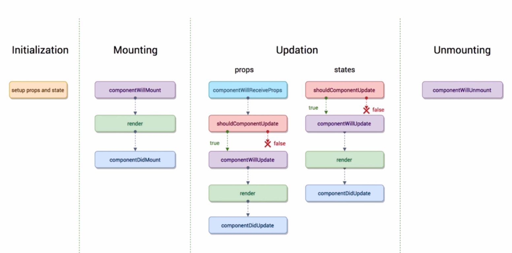

### React知识点笔记

#### 1、组件拆分 与 父子组件传值

#### 2、生命周期

##### React生命周期的四个大阶段：
- （1）Initialization：初始化阶段；
- （2）Mounting：挂载阶段；
- （3）Updation：更新阶段；
- （4）Unmounting：销毁阶段；

> 生命周期函数是到了某一个时刻组件会自动调用执行的函数。

> constructor 不算生命周期函数，它是es6的基本语法。
>但它的性质相当于React的 Initialization阶段（定义属性props和状态state）。

##### Mounting 挂载阶段的生命周期函数
- （1）componentWillMount
- （2）render
- （3）componentDidMount
- 注意：`componentWillMount`和`componentDidMount`这两个声明周期函数，只在页面刷新时执行一次，
而render函数是只要state和props变化就会执行！

##### Updation更新阶段的生命周期函数
1、props属性改变
2、state属性改变

- shouldComponentUpdate 会在组件更新之前，自动被执行。`它要求返回一个布尔类型的结果，必须有返回值。`
- componentWillUpdate 如果shouldComponentUpdate返回false，则这个函数不会被执行。
- componentDidUpdate 组件更新之后执行，它是组件更新的最后一个环节。
- componentWillReceiveProps 子组件接收到父组件传递过来的参数，父组件render函数重新被执行，这个生命周期就会被执行。

 

